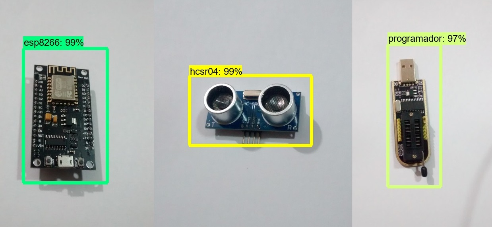
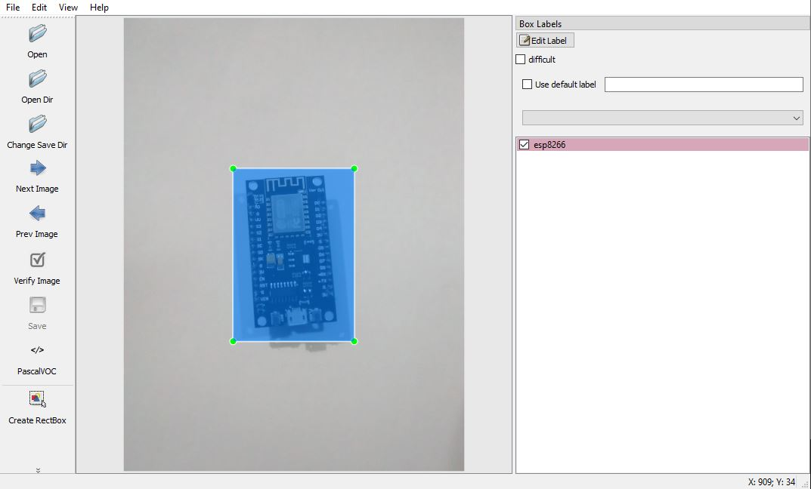
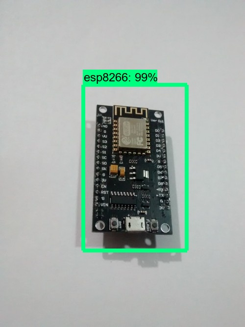
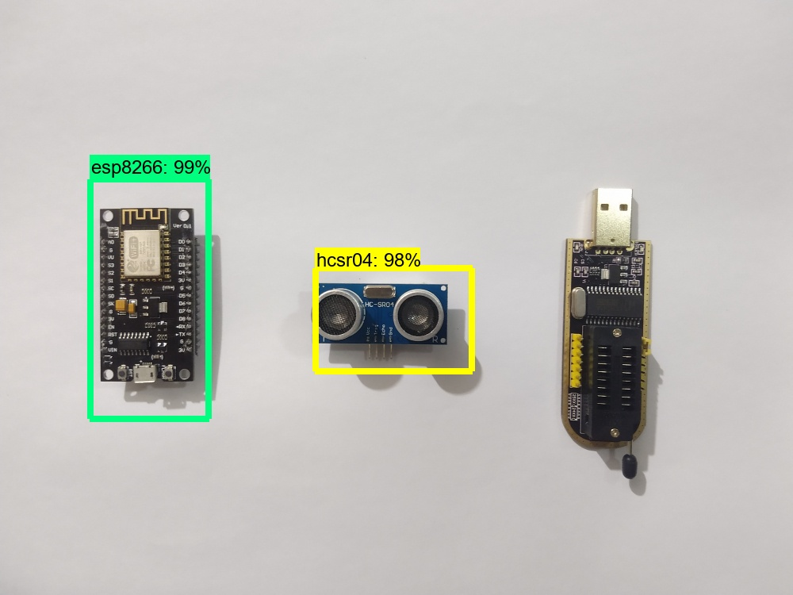

# Entrenar una Red Neuronal para detectar y clasificar varios objetos usando TensorFlow (GPU) en Linux o Windows.

## Introduction
El propósito de este documento es explicar cómo entrenar su propio clasificador de detección de objetos de [red neuronal convolucional](https://www.juanbarrios.com/redes-neurales-convolucionales) para múltiples objetos, comenzando desde cero. Al final de este documento, tendrá un programa que puede identificar y dibujar cuadros alrededor de objetos específicos en imágenes(.jpg), videos(.mp4) o en una cámara web(streaming).
Este Documento está escrito para ubuntu 18.04 lts (64-bits). Tambien funcionará para Windows 10. El procedimiento general también se puede utilizar para los sistemas operativos Linux, pero las rutas de archivo y los comandos de instalación de paquetes deberán cambiar en consecuencia. Para el entrenamiento usé TensorFlow-GPU v1.5, pero es probable que funcione para futuras versiones de TensorFlow como  GPU-2.3 Cuda.
TensorFlow-GPU permite que la PC use la tarjeta de video para proporcionar potencia de procesamiento adicional durante el entrenamiento, por lo que se usará para este proposito. En mi experiencia, usar TensorFlow-GPU en lugar de TensorFlow-cpu regular reduce el tiempo de entrenamiento en un factor considerable, desde 10 a 100 veces mas rápido. La versión solo para CPU de TensorFlow también se puede usar para este instructivo, pero llevará más tiempo en el entrenamiendo de la red neuronal. El tiempo de penderá de la cantidad de imagenes que se utilice para entrenar y la cantidad de objetos que se desea clasificar. Si usa TensorFlow solo para CPU, no necesita instalar CUDA.

## objetivo
Se pevee reconocer 3 objetos dentro de una imagen(.jpeg), un video(.mp4) o desde la webcam(streaming). Los 3 objetos que se utilizaran para entrenar la red neruronal son
1. Modulo de arduino esp8266 
2. Modulo de arduino sensor ultrasonido (hcsr04)
3. placa programador (ch341) usb de memorias eeprom 24x/25x 

## resultados previstos
Se desea recuadrar sobre una imagen o video un rectangular que indica el objeto que la red neuronal detectó.
<p align="center">
  
</p>


## Desarrollo

 En este apartado se describen los paquetes, programas y pasos a seguir para entrenar una red neuronal convolucionar y detectar los objetos aprendidos.

1. Configuraciones general y entorno.
2. Generar el entorno (enviroment) para trabajar con la terminal. 
3. Utilizar un modelo pre-entrenado que permite reconocer objetos
4. Prepara los datos para entrenamiento.
4.1. Obtener las imagenes (.jpeg) para entrenar (train) y testear (test)
4.2. Instalar LabImag :
                4.2.1. paquetes requeridos  python 3.5    matplotlib
4.3. Generar los archivos CSV, para entrenar y para testear. 

## Configuraciones generales y entorno
En esta primer etapa se describen los programa y paquetes requeridos para comenzar-

### 1.a- Instalar los paquetes necesarios y crear un entorno de trabajo virtual.

Instalar [python](https://www.python.org/downloads/) ( recomiendo python==3.5 )

Instalar [Anaconda](https://www.anaconda.com/products/individual) para ubuntu o windows 

Instalar [cuda toolkits](https://developer.nvidia.com/CUDA-toolkit), permite utilizar los nucleos de la GPU como procesamiento central. 

Una vez instalado crear un nuevo entorno de trabajo desde la terminal

```
$ conda create -n CNN pip python=3.5
```
activar el nuevo enviroment

```
$ activate CNN 
```

Instalar los siguientes paquetes necesarios 
```
(CNN) $ conda install -c anaconda protobuf
(CNN) $ pip install pillow
(CNN) $ pip install lxml
(CNN) $ pip install Cython
(CNN) $ pip install contextlib2
(CNN) $ pip install jupyter
(CNN) $ pip install matplotlib
(CNN) $ pip install pandas
(CNN) $ pip install opencv-python==3.6

(Nota:Los paquetes ‘pandas’ and ‘opencv-python’  no son necesarios para TensorFlow, pero son usados por los difernetes scripts en python para generar los archivos TFRecords y para trabajar con las imagenes, videos y webcam.
```
en caso de tener numpy==1.19 (no es compatible ), instalar numpy 1.18.

```
(CNN) $ pip install numpy==1.18
```


### 1.b Configurar los PYTHONPATH environment
```
(CNN) $ set PYTHONPATH=CNN/models; CNN/models/research; CNN/models/research/slim
```

### 1.c Compilar Protobufs y correr el setup.py

A continuación, compilar los archivos Protobuf, que utiliza TensorFlow-GPU para configurar el modelo y los parámetros de entrenamiento.

En la terminal de unix o en la Prompt de anaconda, cambiar de directorio a  /models/research:

```
(CNN) $ cd models/research
```
Ejecutar las siguiente linas de comando para instalar los paquetes de object_detection que seran requeridos para entrenar el modelo y reconocer patrones de imagenes que permite detectar objetos.
```
protoc --python_out=. ./object_detection/protos/anchor_generator.proto ./object_detection/protos/argmax_matcher.proto ./object_detection/protos/bipartite_matcher.proto ./object_detection/protos/box_coder.proto ./object_detection/protos/box_predictor.proto ./object_detection/protos/eval.proto ./object_detection/protos/faster_rcnn.proto ./object_detection/protos/faster_rcnn_box_coder.proto .\object_detection\protos\grid_anchor_generator.proto .\object_detection\protos\hyperparams.proto ./object_detection/protos/image_resizer.proto ./object_detection\protos\input_reader.proto .\object_detection\protos\losses.proto .\object_detection\protos\matcher.proto ./object_detection/protos/mean_stddev_box_coder.proto .\object_detection\protos\model.proto .\object_detection\protos\optimizer.proto .\object_detection\protos\pipeline.proto ./object_detection/protos/post_processing.proto ./object_detection\protos\preprocessor.proto .\object_detection\protos\region_similarity_calculator.proto ./object_detection/protos/square_box_coder.proto ./object_detection\protos\ssd.proto .\object_detection\protos\ssd_anchor_generator.proto ./object_detection/protos/string_int_label_map.proto ./object_detection/protos/train.proto ./object_detection\protos\keypoint_box_coder.proto ./object_detection/protos/multiscale_anchor_generator.proto ./object_detection/protos/graph_rewriter.proto ./object_detection/protos/calibration.proto ./object_detection/protos/flexible_grid_anchor_generator.proto
```
Finalmente, correr los siguientes comandos desde la terminal :  models/research/object_detection:

```
(CNN) models/research $ python setup.py build
(CNN) models/research $ python setup.py install
```

## 2 Crear los archivos necesarios
En esta etapa se procede a crear los archivos requeridos para entrenar el modelo de red neuronal convolucional. Para ello se requiere muchas imagenes. Se aconseja un minimo de 100 imagenes con un tamaño de 1000x1000 pixeles. Tener en cuenta que cuanto mayor pixles aumentará drasticamente el tiempo de entrnamiento. Se crearan dos carpetas, una donde contedrá todas las imagenes que se utilizaran para entrenar y otra carpeta test que utiliza tensorFlow para corregir mediante gradiente descendiente los diferentes pesos.

### 2.1 Imagenes y labels
Sacar fotos, bajarlas de google etc. Las imagenes deben ser claras y varibles, cuantas mas imagenes el modelo podrá predecir mejor. Un vez que se tenga todas la imagenEs donde aparecen los objetos que se desean detectar, se requiere generar un archivos xlm por cada una de las imagenes. Para ello se utilizará el programa [labelImag]( https://github.com/sequeirandres/LabeIImage)
Se recomienda utilizar el  80% de las imagenes para train y el 20% para test. Para mi caso, deseo identificar 3 objetos por ende mis labels van a ser :

a.- esp8266

b.- hcsr04

c.- programador

Requerimientos para labelimg:

1.- python==3.5 o supeior

2.- opencv-python


para iniciar el programa desde la terminal parado sobre el directorio 

```
(CNN) $ python labelImg.py
```
Imagen de labImagen etiquentando un objeto dentro de una imagen
<p align="center">
  
</p>

Asi se etiqueta cada uno de los objetos para cada una de las imagenes correspondientes.


### 2.2 Crear archivos xlm a paratir de todas imagenes

A partir de los archivos generado xlm se procede a generar un solo archivo test.csv que contiene toda la informacion de todos los archivos xlm. 

```
(CNN) $ python xml_to_csv.py --inputs=images/train --output=images

Successfully converted xml to csv.
```
```
(CNN) $ python xml_to_csv.py --inputs=images/test --output=images

Successfully converted xml to csv.
```
Estas lineas generan dos archivos test_labels.csv y train_labels.csv dentro de la carpeta imagenes


### 2.4 Crear los archivos tf.records 
Los archivos .record contiene la informacion de todas las imagenes junto a todas los lugares donde aparecen los objetos con las etiquetas que permiten identificar que objetos hay en cada imagen y que debe entrenar nuestro modelo de CNN.

```
(CNN)  $ python generate_tfrecord.py --csv_input=images/train_labels.csv --image_dir=images/train --output_path=train.record
Successfully created the Records files: /train.record
```

```
(CNN)  $ python generate_tfrecord.py --csv_input=images/test_labels.csv --image_dir=images/test --output_path=test.record
Successfully created the Records files: /test.record
```

## 3 Crear y entrenar  el modelo CNN


### 3.1 Obtencion de modelo de red neuraonl convolucional
 
Para este caso se utilizará una red  neuronal convolucional pre-entrenada, es decir, las redes neuronales poseen multiples capas y multiples conexiones de capa a capa.

para reducir el timpo de entrenamiento se utiliza el siguiente modelo [CNN](https://github.com/sequeirandres/ModeloCNN)

sin embargo existes muchos modelos de redes neuronales que se pueden descargar y utilizar desde [CNN](https://github.com/tensorflow/models/blob/master/research/object_detection/g3doc/tf1_detection_zoo.md)
 
###


## 4 exportar el modelo entrenado

## 5 Hacer reconocimiento de objetos sobre imagenes

### 5.1. Reconocimiento sobre imagenes

Deteccion de un objeto 


<p align="center">
  
</p>


Resultado de una imagen con los 3 objetos a detectar

<p align="center">
  
</p>


### 5.2 Reconociemiento sobre videos


### 5.3 Reconociemiento en tiempo real con webcam 


